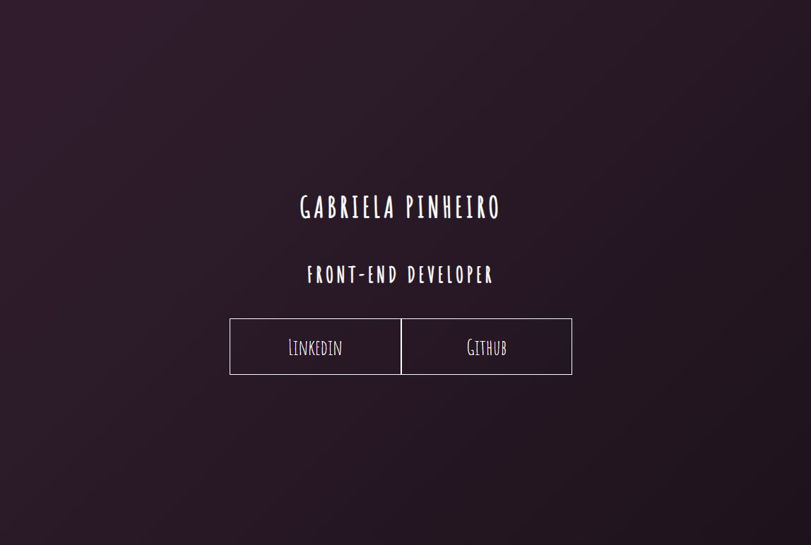

### **DESAFIO PROPOSTO NO BOOTCAMP DA DIO:**

<h2 align="center" color="red" >

***LANDING PAGE***

</h2>

<h3 align="center">

**Criado e desenvolvido por:** *Thiago de Oliveira Miranda*

</h3>

***

 

&emsp;&emsp;O desafio proposto consistia em criar uma ***landing Page***, aplicando os conhecimentos aprendidos de animações em CSS. Foram explorados os conceitos de ***CSS Transitions***, utilizando pseudo elementos e pseudo classes, e ***CSS @keyframes*** para desenvolver animações com regras específicas. A página de portifólio, contém o ***hamburguer menu*** ensinado no bootcamp da DIO, além de efeitos manipulando ***filters*** nas imagens. 

&emsp;&emsp;Para finalizar a página, foram inseridos links para outros projetos contidos em meu ***Github*** com um breve descritivo de cada atividade. 

 

***

 

### **Resultado esperado:**

 

Figura 01: Landing Page

 

***

 

<h2 align="center">

  **MELHORIAS IMPLEMENTADAS**

</h2>

### **Resultado obtido:**

 

Figura 02: Resultado do desafio.

 

Figura 02: Versão para dispositivos móveis.

 

* [x]  Background animado;
* [x]  Card principal com efeito ***Glassmorph*** e interativo ao clique em desktops;           
* [x]  Efeito de transição ***hover*** nos cards entre ***.gif*** e ***.jpg***.;
* [x]  Links do menu hamburguer funcionais;
* [x]  Efeitos sonoros nos links e menu;
* [x]  Modificações no layout e dimensões da navbar em dispositivos mobiles;
* [x]  Condição que monitora o evento ***scroll*** da tela para esconder a navbar em dispositivos mobile;
* [x]  Responsividade para telas menores e dispositivos móveis;
* [x]  O design e a disposição dos botões muda para adequar a funcionalidade para tablets e celulares;
* [x]  Link das atividades de Keyframes & Transitions;
* [x]  Customização da scrollbar;

 

***

